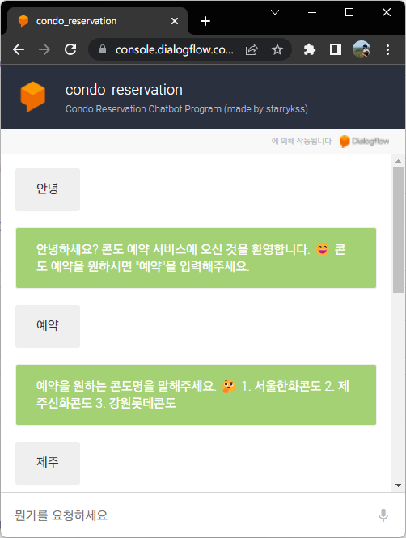
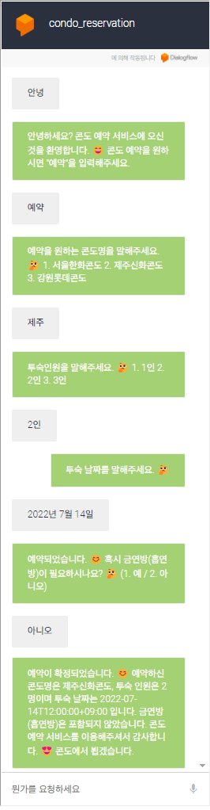
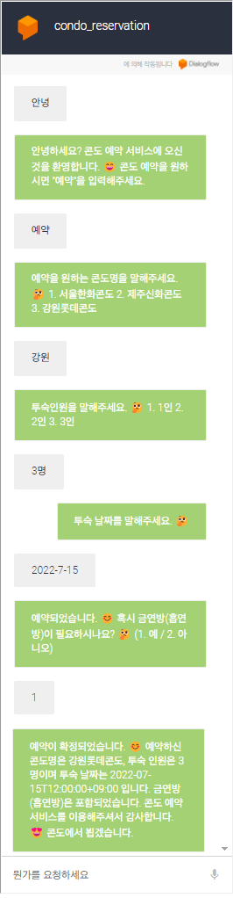

# Condo Reservation Chatbot Program With Dialogflow
[2022-05-09 ~ 2022-06-02] Condo Reservation Chatbot Program With Google Dialogflow

</img>

### 프로그램 제작 배경
- 요즘 핫한 챗봇 서비스의 작동 원리를 이해하고, 간단하게 구현해보고자 프로그램을 제작하게 되었다.
- 동시에 현업 개발자 멘토님을 통해 ***프로그램의 기획 및 개발, 운영 방법*** 을 배웠다.

### 프로그램 소개
- [Google Dialogflow](https://dialogflow.cloud.google.com/) 를 이용하여 만든 **콘도 예약 챗봇 프로그램**
- **프로그램 테스트** : [click](https://console.dialogflow.com/api-client/demo/embedded/59531864-2bf1-48c7-a3e0-da40d62a1371)
  - 링크에 접속한 후, 챗봇에게 **인사** 를 한다.
    - *"안녕", "안녕하세요", "하이"...*
  - 챗봇의 지시에 따라 답변을 한다.

### 예약 기능 설명
- 예약 가능한 콘도
  - 서울한화콘도
  - 제주신화콘도
  - 강원롯데콘도
- 투숙 일정
- 투숙 인원
  - 1인
  - 2인
  - 3인
- 금연방(흡연방) 선택

### 기타
- 프로그램에 대한 자세한 설명은 레포지토리에 있는 `"ProgramInfo.pdf"` 파일에 있다.
- 필요할 경우, Google Dialogflow 에서 `[Program] condo_reservation.zip` 파일을 임포트하여 사용하면 된다.

### 실행 화면

<table>
  <th></img></th>
  <th></img></th>
</table>
